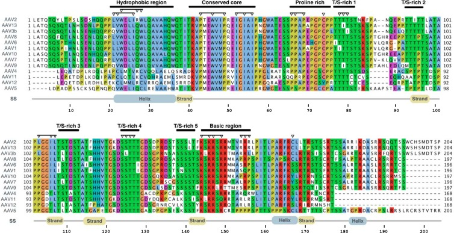
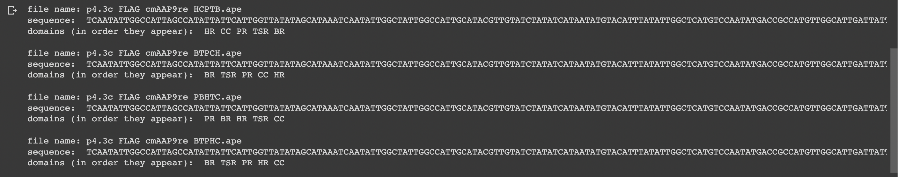

# Assembly-Activating Protein (AAP) Domain Finder
GenBank files are standard in bioinformatics for storing DNA / protein sequences with detailed annotations. The [ApE plasmid editor](https://jorgensen.biology.utah.edu/wayned/ape/) uses a variant of this format called `.ape` files. 

This Python script scans AAV capsid `.ape` files to identify and map assembly-activating protein (AAP) domains (like HR, CC, BR, TSR, PR) based on their nucleotide sequences, outputting the domain order found in each sequence. The AAP is crucial for assembling adeno-associated virus (AAV) capsids, which are widely used in gene therapy.

  

## Instructions
1. Store your GenBank / `.ape` sequence files in a Google Drive folder.
2. Edit the path to your folder.
3. Update the dictionary with your domains of interest.
4. Run the program.
Sample output:

  

